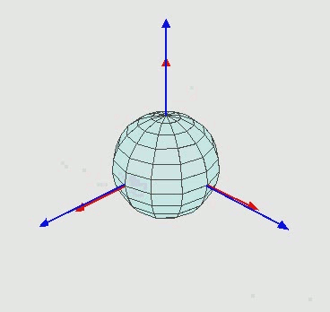
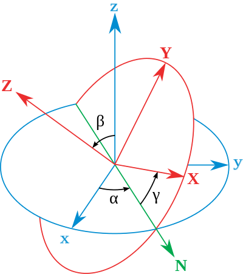
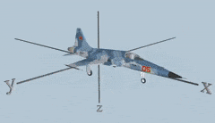

# 设计与实现

本文档说明 flyrt 四轴飞行器飞控系统的整体设计, 理论依据与关键实现方式, 内容与 `flyrt/` 目录下的工程实现保持一致 

## 项目概述

本项目是一套运行在 STM32F4 平台上的四轴飞行器飞控系统, 主要完成飞行姿态的采集, 解算, 滤波与控制输出 

| 项目 | 内容 |
| --- | --- |
| 主控芯片 | STM32F407ZGTx, Cortex-M4 内核, 系统主频 168MHz |
| 开发环境 | Keil MDK5, 工程文件 `flyrt/flight-control.uvprojx` |
| 底层软件库 | STM32F4xx 标准外设库, 编译宏 `USE_STDPERIPH_DRIVER` |
| 姿态传感器 | MPU6050 六轴传感器, 包含三轴加速度计与三轴陀螺仪 |
| 执行机构 | 4 个电调与 4 个无刷电机, 由 PWM 信号驱动 |
| 调试接口 | USART1, 波特率 9600, 8 位数据位, 1 位停止位, 无校验 |

系统当前已经打通姿态采集, 姿态解算, 姿态数据串口输出与基于串口指令的电机控制流程, 滤波效果与姿态闭环控制仍在调试完善中 

## 理论知识

### 欧拉角

用来唯一地确定`定点转动刚体`位置的`三个一组`的独立角参量, 在本项目中, 也用来描述飞行器的位置; 有两组坐标, `xyz`为全局坐标, 保持不动, `XYZ`为局部坐标, 跟随物体一起运动 

 

 

### 姿态解算

姿态解算的目的是计算出飞行器的俯仰角(Pitch), 滚转角(Roll)和偏航角(Yaw), 通过这些角度调整电机输出实现稳定飞行, 六轴传感器无法计算偏航角, 计算偏航角需要九轴传感器, 例如MPU9250 

姿态解算的过程中最关键的是数据滤波, 滤波后的数据才能够作为正确的姿态数据传递给飞控系统; 本项目在 `filter.c` 中采用卡尔曼滤波算法, 将陀螺仪积分得到的高频响应与加速度计解算得到的角度参考值进行融合, 具体的实现方式见后文关键实现部分 

### MPU6050零偏校准

MPU6050存在零偏现象, 当传感器静置时, 仍然会有加速度与角速度的存在, 因此要进行零偏校准 

角速度零偏由卡尔曼滤波内部的状态量在线估计, 在滤波过程中随观测量持续修正, 不需要单独标定 

角度零偏由 `ekf_calibrate` 在开机时标定, 标定期间要求飞行器保持静置, 连续采样 200 次滤波后的角度, 取平均值作为 roll 与 pitch 的角度零偏, 之后每轮解算结果都减去该零偏, 得到去除零偏的 `ekf_roll_cor` 与 `ekf_pitch_cor`; 标定只在上电时执行一次, 运行过程中不再更新 

## 硬件选型

常见的四轴飞行器分为`X`型和`+`型, X型的飞行器机动性能更好(同样也更好找资料), 更好实现飞行控制, 所以本项目中我们将飞行器设计为X型 

### 机架

选用F450机架 

### 电机

选用XXD(新西达)2212 1000KV电机x4; 电机的转速为`KV值*电压`, 例如1000KV的电机在10V的电压下就是10000转/分钟, 当然这是在空转的情况下; 一般来讲KV值低的配较大的桨叶, KV值高的配较小的桨叶 

`22`指电机直径, `12`指电机机身长度; `2212`表示线圈外径22mm, 长度12mm 

> 参考数据: GWS1047RS桨, 11V 15.6A, 6810转, 推力886克 

### 电调

选用XXD(新西达)30A电调x4, 30A表示持续最大电流承受能力; 电调根据飞控信号或油门输入调节提供给电机的电流和电压; 电调的电流承受能力必须大于或等于电机的最大电流需求 

电调使用PWM信号进行控制, 并且电调本身可以通过BEC给开发板供电, 所以说电源仅仅需要对四个电调进行供电, 不需要额外给开发板以及姿态传感器供电 

### 桨叶

选用1047桨叶, 正反叶各一对 

10表示螺旋桨的`直径`为10英寸, 表示总长度; 47表示`螺距`为4.5英寸, 意为在一整圈旋转中, 叶片理论上沿前进方向的推进距离, 就是螺旋桨前进时切割空气的角度 

P指正旋螺旋桨, 表示顺时针(CW, Clockwise)方向旋转, 顺时针旋转时对飞行器产生向上的推力; R指反旋螺旋桨, 表示逆时针(CCW, Counter-Clockwise)方向旋转, 逆时针旋转时对飞行器产生向上的推力; 相邻的电机需要使用相反旋转方向的螺旋桨用以平衡扭矩 

### 电源

选用2200mAh, 30C, 3S电源x1, 采用`分电板PDB`, 为四个电调同时供电; 电源与分电板使用XT60连接, 并且将电调与分电板焊接在一起; 同时搭配`低压报警器`, 当电源电压过低时, 将会触发飞行器返航 

2200mAh表示电池容量, 意味着在一小时内放电2200毫安, 电池会完全放电 

30C表示电池的放电倍率, 意味着电池可以安全输出的最大电流为: 2200mAhx30C = 66A 

3S表示电源中有3节电池串联, 也就是11.1V(每个锂电池标称电压为3.7V) 

## 系统设计

### 硬件连接

| 外设 | 引脚 | 说明 |
| --- | --- | --- |
| TIM2_CH1 | PA0 | 电机 A 的 PWM 信号 |
| TIM2_CH2 | PA1 | 电机 B 的 PWM 信号 |
| TIM2_CH3 | PA2 | 电机 C 的 PWM 信号 |
| TIM2_CH4 | PA3 | 电机 D 的 PWM 信号 |
| 软件 I2C 时钟线 | PB6 | 连接 MPU6050 的 SCL |
| 软件 I2C 数据线 | PB7 | 连接 MPU6050 的 SDA |
| USART1_TX | PA9 | 调试串口发送, 连接上位机的接收端 |
| USART1_RX | PA10 | 调试串口接收, 连接上位机的发送端 |

电机编号与安装位置以及旋转方向的对应关系如下, 机头方向朝上 

```text
B (逆时针)  A (顺时针)
      ^ 机头方向
C (顺时针)  D (逆时针)
```

对角位置的两个电机旋转方向相同, 相邻位置的两个电机旋转方向相反, 用以平衡螺旋桨旋转产生的反扭矩 

### 软件模块划分

| 模块 | 文件 | 职责 |
| --- | --- | --- |
| 主程序 | `flyrt/Main/main.c` | 外设初始化, 姿态解算主循环, 串口指令解析与执行 |
| I2C 驱动 | `flyrt/Include/iic.c` `flyrt/Include/iic.h` | 总线抽象与寄存器读写接口, 当前使用软件 I2C |
| 姿态传感器驱动 | `flyrt/Include/mpu6050.c` `flyrt/Include/mpu6050.h` | MPU6050 寄存器配置, 原始数据读取与温度换算 |
| 姿态解算与滤波 | `flyrt/Include/filter.c` `flyrt/Include/filter.h` | 原始数据换算, 加速度计求角, 卡尔曼滤波与零偏校准 |
| 姿态控制 | `flyrt/Include/pid.c` `flyrt/Include/pid.h` | PID 控制器实现与电机动力分配 |
| 电机控制 | `flyrt/Include/bldc.c` `flyrt/Include/bldc.h` | TIM2 四通道 PWM 输出与电调解锁 |
| 串口通信 | `flyrt/Include/usart.c` `flyrt/Include/usart.h` | USART1 初始化, 中断接收组包与 printf 重定向 |
| 通用工具 | `flyrt/Include/tool.c` `flyrt/Include/tool.h` | 开方倒数快速计算, 原始值转弧度与快速排序 |
| 延时 | `flyrt/Include/delay.c` `flyrt/Include/delay.h` | 基于 SysTick 的微秒, 毫秒与秒级延时 |
| 底层库与启动文件 | `flyrt/Library` `flyrt/Startup` | STM32F4xx 标准外设库与启动汇编文件 |

### 主流程

```text
usart1_init(9600)               调试串口初始化
tim2_init()                     TIM2 四通道 PWM 初始化
mpu6050_init(GPIOB, PB6, PB7)   软件 I2C 与 MPU6050 初始化
bldc_init()                     四个通道输出最大脉宽, 等待电调解锁
ekf_calibrate()                 静置采样 200 次, 计算角度零偏
while (1)
    ekf_exec()                  姿态采集, 解算, 滤波与串口输出
    bldc_control()              读取串口指令并执行对应动作
```

## 关键实现

### 姿态数据采集

- MPU6050 通过软件 I2C 访问, 从机地址为 0x68, 写地址为 0xD0, 读地址为 0xD1 
- SCL 与 SDA 配置为开漏输出并开启内部上拉, 总线空闲时均为高电平, 由 GPIO 翻转模拟 I2C 时序 
- 总线以 `I2C_BUS` 结构体的形式对外提供接口, 结构体内保存读写寄存器与应答检测的函数指针, 寄存器读写统一通过 `I2C_Write_Reg` 与 `I2C_Read_Reg` 完成; 通过 `Hard_I2C_EN` 区分软件时序与硬件 I2C 外设两种实现, 便于后续更换为硬件 I2C 
- 读寄存器时序为: 起始, 从机地址加写, 寄存器地址, 重复起始, 从机地址加读, 读取一个字节, 非应答, 停止 
- 初始化配置为采样率 500Hz, 数字低通滤波器带宽 5Hz, 陀螺仪量程正负 2000 度每秒, 加速度计量程正负 16g, 关闭 FIFO 与中断, 时钟源选择 X 轴陀螺仪 
- 陀螺仪在正负 2000 度每秒量程下的灵敏度为 16.4 LSB/(度每秒), 加速度计在正负 16g 量程下的灵敏度为 2048 LSB/g, 换算关系可参考 MPU-6000A 寄存器手册 
- 原始数据由 `mpu6050_get_raw` 逐寄存器读取, 包含三轴加速度, 三轴角速度与温度; 温度换算关系为原始值除以 340 再加 36.53 

### 姿态解算与卡尔曼滤波

每轮解算的处理流程如下 

1. 读取温度与三轴加速度, 三轴角速度原始数据 
2. 将原始数据换算为物理量, 单位为 g 与 度每秒 
3. 使用反正切公式计算加速度计参考角, roll 为 atan(accy/accz), pitch 为 atan(accx/accz), 结果由弧度转换为角度 
4. 将加速度计参考角与陀螺仪角速度送入卡尔曼滤波, 得到融合后的 roll 与 pitch 
5. 融合结果减去角度零偏, 得到 `ekf_roll_cor` 与 `ekf_pitch_cor` 

卡尔曼滤波采用二维状态模型, 状态量为角度与陀螺仪零偏, 观测量为加速度计解算角度 

- 状态方程: 当前角度 = 上一时刻角度 + (角速度 - 零偏) x 采样周期 
- 协方差预测: P = F x P x F^T + Q 
- 卡尔曼增益: K_0 = P[0][0] / (P[0][0] + R_angle), K_1 = P[1][0] / (P[0][0] + R_angle) 
- 状态更新: 角度 = 角度 + K_0 x (观测量 - 角度), 零偏 = 零偏 + K_1 x (观测量 - 角度) 
- 协方差更新: P = (I - K x H) x P 
- 参数取值为 Q_angle = 0.003, Q_gyro = 0.003, R_angle = 0.5, 采样周期 dt = 0.01s 
- roll 与 pitch 各自维护独立的零偏, 卡尔曼增益与协方差矩阵, 两者解算过程互不影响 
- 由于六轴传感器无法观测偏航角, 当前没有实现 yaw 角的解算与输出 

### 姿态控制

PID 控制器由 `PID_Controller_t` 描述, 保存比例, 积分, 微分系数, 目标值, 实测值, 误差, 积分量, 微分量, 输出值, 以及输出限幅, 积分限幅与积分分离门限 

`pid_compute` 的计算过程如下 

- 误差为目标值减去实测值 
- 积分分离: 误差绝对值小于积分分离门限时累加积分并对积分量限幅, 误差超过门限时清零积分, 避免大误差下的积分累积 
- 微分项取当前误差与上一次误差的差值 
- 输出为三项加权求和, 再做输出限幅 

`attitude_control` 分别计算 pitch 与 roll 的 PID 输出, 再按照 X 型结构叠加到基准 CCR 上, 得到四个电机的目标 CCR 

```text
motor_a(右前) = base_ccr + pitch_out + roll_out
motor_b(左前) = base_ccr + pitch_out - roll_out
motor_c(左后) = base_ccr - pitch_out - roll_out
motor_d(右后) = base_ccr - pitch_out + roll_out
```

四个电机的目标 CCR 最终被限制在 `PWM_MIN` 与 `PWM_MAX` 之间, 再下发给 `bldc_ccr`; 当前 PID 参数为 kp = 3.0, ki = 0.01, kd = 1.2, 输出限幅为正负 200 

### 电机控制

- TIM2 挂载在 APB1 总线上, 定时器时钟为 84MHz 
- 预分频系数为 84 - 1, 计数时钟为 1MHz, 自动重装载值为 20000 - 1, 因此 PWM 周期为 20ms, 频率为 50Hz 
- 比较值取 1000 时输出脉宽 1ms, 取 2000 时输出脉宽 2ms, 对应电调的最低与最高油门行程 
- 四个通道工作在 PWM1 模式, 输出极性为高, 并使能比较值预装载, 保证占空比在计数周期结束时统一更新, 避免输出跳变 
- `bldc_init` 在上电时把四个通道的比较值都置为 `PWM_MAX`, 输出最大脉宽信号, 使电调进入行程识别流程 
- `bldc_ccr` 直接写入 TIM2 的四个比较寄存器, 完成四个电机的同步更新 

### 串口通信

- USART1 使用 PA9 作为发送引脚, PA10 作为接收引脚, 工作在收发模式, 参数为 9600 波特率, 8 位数据位, 1 位停止位, 无校验, 无硬件流控 
- 使能接收非空中断, 中断服务函数中按照 0x0D 0x0A 结尾组包, 数据存入 `USART_RX_BUF`, 接收状态记录在 `USART_RX_STA` 
- 通过重定向 `fputc` 将 `printf` 输出到 USART1, 发送前查询状态寄存器的发送空标志, 保证数据发送完成 
- 姿态数据, 调试信息与串口指令都通过该串口收发 

### 串口指令

| 指令 | 功能 |
| --- | --- |
| `1` | 基准 CCR 加 1, 基准值低于 1100 时先提升到 1100 |
| `2` | 基准 CCR 减 1, 基准值低于 1100 时先提升到 1100 |
| `3` | 四个通道的比较值复位为 `PWM_MIN`, 基准 CCR 置为 1000, 四个电机的偏移量清零 |
| `4` | 目标 pitch 与 roll 置为 0 度并执行一次姿态控制, 对应悬停 |
| `5` | 目标 pitch 置为负 5 度并执行一次姿态控制, 对应前进 |
| `6` | 目标 pitch 置为正 5 度并执行一次姿态控制, 对应后退 |
| `7` | 目标 roll 置为正 5 度并执行一次姿态控制, 对应向左 |
| `8` | 目标 roll 置为负 5 度并执行一次姿态控制, 对应向右 |
| `9` | 输出当前的 roll 与 pitch 角度值 |
| `0` | 将当前基准 CCR 应用到四个电机 |

## 当前状态与待完善

- 姿态控制没有周期执行, `attitude_control` 只在收到指令 4 至 8 时调用一次, 主循环中的调用处于注释状态, 尚未形成闭环控制 
- `pid_init` 在每次姿态控制中都会被调用, 会重置积分量与误差; 积分分离门限与积分限幅没有赋值, 积分项输出始终为 0, 当前实际为 PD 控制 
- `mpu6050_get_raw` 中陀螺仪 Y 轴与 Z 轴的读取结果被写入 `GyroX` 成员, `GyroY` 与 `GyroZ` 成员没有被赋值, 解算过程中使用到的是未初始化的数据 
- 加速度计换算按照 16384 LSB/g 计算, 与初始化的正负 16g 量程不一致; 由于求角使用分量比值, 角度结果不受影响, 但换算后的数值不是真实的加速度值 
- 原始值的正负判断分支以 32764 与 32768 作为阈值, 而数据实际已经转换为 `int16_t` 类型的浮点数, 负值分支不会触发, 负角度与负角速度的符号处理没有生效 
- 主循环直接读取串口的数据寄存器, 与 USART1 接收中断争用同一数据源, 指令存在被丢弃的可能 
- `ekf_exec` 每轮循环都会通过串口输出姿态数据, 占用串口带宽并影响循环周期; 同时滤波的采样周期固定为 0.01s, 与实际循环周期不一致, 会影响滤波效果 
- `mpu6050_get_angle` 中的互补滤波实现与 `kalman.c` `kalman.h` 中的卡尔曼实现都属于早期代码, 未参与当前流程, 其中 `kalman.c` 没有加入 Keil 工程编译; `delay_100ns` 通过复位 TIM2 计数器实现, 与 PWM 输出复用同一个定时器, 当前没有被调用 

## 参考资料

[DIY组装无人机电机+电调+电池+桨叶搭配知识_电调电机电池搭配原则-CSDN博客](https://blog.csdn.net/m0_62458936/article/details/127206719) 

项目相关的芯片资料存放在 `docs/` 目录下 

- [C24112_姿态传感器-陀螺仪_MPU-6050_规格书_WJ39646.PDF](C24112_姿态传感器-陀螺仪_MPU-6050_规格书_WJ39646.PDF) 
- [RM-MPU-6000A-寄存器映射和说明.pdf](RM-MPU-6000A-寄存器映射和说明.pdf) 
- [STM32F407数据手册.pdf](STM32F407数据手册.pdf) 
- [STM32F407参考手册-中文版.pdf](STM32F407参考手册-中文版.pdf) 
